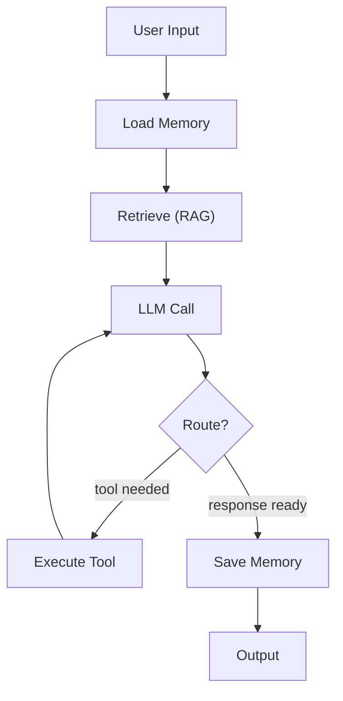

Agentic AI systems are rapidly moving beyond simple chain-of-thought prompting into something far more powerful: multi-step, stateful reasoning loops that can use tools, retrieve information, and maintain context across extended interactions. At the heart of this evolution lies the **stateful graph** — a computational paradigm in which each node in a directed graph reads and writes to a shared, typed state object as it executes.

In this post, we’ll explore why stateful graphs matter for production agentic systems, and how the combination of **LangGraph**, **RAG**, **memory**, and **Langfuse** creates a robust, observable pipeline.

## From Chains to Graphs

Traditional LLM chains are linear — a sequence of steps where the output of one step feeds into the next. This works for simple tasks but breaks down when an agent needs to:

- **Loop** — retry a failed tool call or re-prompt with additional context.
- **Branch** — take different actions based on intermediate results.
- **Persist** — maintain conversation history, user preferences, or entity knowledge across multiple turns.
- **Coordinate** — manage sub-agents or parallel execution paths.

Graph-based architectures solve all of these. By modelling the agent as a **stateful directed graph** (or more precisely, a state machine), we gain the ability to represent conditional logic, cycles, and persistence as first-class constructs.

> [!NOTE]
> Stateful graphs are not a new idea — they have been the backbone of workflow engines, telephony systems, and game AI for decades. What makes them fresh in the LLM space is the addition of **learned reasoning** at each node.

## LangGraph: Stateful Graphs as the Backbone

[LangGraph](https://langchain-ai.github.io/langgraph/) is an open-source framework for building stateful, multi-actor applications with LLMs. It extends the LangChain ecosystem by introducing a graph-based execution model where:

- **Nodes** represent computation steps (LLM calls, tool invocations, human-in-the-loop).
- **Edges** define the flow of control, including conditional routing.
- **State** is a shared, typed object that persists across node executions and is checkpointed automatically.

```python
from langgraph.graph import StateGraph, END
from typing import TypedDict, List

class AgentState(TypedDict):
    messages: List[dict]
    context: List[str]
    next_step: str

def call_model(state: AgentState) -> AgentState:
    response = llm.invoke(state["messages"])
    state["messages"].append(response)
    return state

def route_after_model(state: AgentState) -> str:
    if "TOOL:" in state["messages"][-1].content:
        return "execute_tool"
    return END

graph = StateGraph(AgentState)
graph.add_node("model", call_model)
graph.set_entry_point("model")
graph.add_conditional_edges("model", route_after_model)
```

This pattern gives you **deterministic control flow** — you know exactly what path your agent took at every step, because the graph is compiled and can be visualised, replayed, and traced.

> [!IMPORTANT]
> When designing a stateful graph, always define your **state schema first**. The shape of your state dictates what each node can read and write, and it's much harder to change once nodes depend on specific fields.

### Why State Matters

In a stateless chain, every request starts from scratch. In a stateful graph:

- **Checkpoints** allow you to pause and resume execution at any point.
- **Human-in-the-loop** becomes natural — the graph waits at a node for human input before proceeding.
- **Debugging** is dramatically easier — you can replay a graph run step by step, inspecting state at each node.

## RAG: Grounding Agent Decisions in Knowledge

A stateful graph is only as useful as the information it can access. **Retrieval-Augmented Generation (RAG)** grounds agent responses in external knowledge, reducing hallucination and enabling access to private or domain-specific data.

Integrating RAG into a LangGraph pipeline is straightforward — a retrieval node becomes just another step in the graph:

```python
def retrieve_context(state: AgentState) -> AgentState:
    query = state["messages"][-1].content
    docs = vector_store.similarity_search(query, k=5)
    state["context"] = [doc.page_content for doc in docs]
    return state

graph.add_node("retrieve", retrieve_context)
graph.add_edge("retrieve", "model")
```

The key insight is that **retrieval is stateful** — the retrieved documents become part of the agent's state, influencing subsequent LLM calls, tool choices, and even the next retrieval step. This creates a feedback loop where the agent can iteratively refine its search based on what it has already learned.

### Advanced RAG Patterns in Graphs

- **Multi-hop retrieval** — run retrieval multiple times, using the results of one retrieval to formulate the next query.
- **Corrective RAG** — if the LLM determines retrieved documents are insufficient, route back to a retrieval node for better results.
- **Agentic RAG** — the agent decides not just *what* to retrieve, but *which* data source or tool to use.

## Memory: Persistent Context Across Turns

State flows through the graph's edges during a single execution, but **memory** is what persists across separate invocations. Without memory, every new conversation feels like talking to a stranger.

LangGraph supports multiple memory layers:

### Short-term Memory
The graph's `State` object holds the current turn's context — messages, retrieved documents, intermediate results. This is automatically checkpointed.

### Long-term Memory
Stored externally (in a vector store, key-value store, or database) and loaded at the start of each graph run:

```python
def load_memory(state: AgentState, config) -> AgentState:
    user_id = config["configurable"]["user_id"]
    state["history"] = memory_store.get_conversation(user_id)
    return state

def save_memory(state: AgentState, config) -> AgentState:
    user_id = config["configurable"]["user_id"]
    memory_store.save_conversation(user_id, state["messages"])
    return state

graph.add_node("load_memory", load_memory)
graph.add_node("save_memory", save_memory)
graph.set_entry_point("load_memory")
# ... after all processing
graph.add_edge("model", "save_memory")
```

### Types of Agent Memory

| Memory Type | Storage | Lifespan | Example |
|---|---|---|---|
| **Conversation buffer** | Graph state | Single session | Recent messages |
| **Sliding window** | Graph state / KV store | Last N turns | Last 20 messages |
| **Summary memory** | LLM-generated | Across sessions | "User prefers concise answers" |
| **Entity memory** | KV store | Across sessions | "User's name is Alice" |
| **Vector memory** | Vector store | Across sessions | Semantic recall of past interactions |

## Langfuse: Observability for Graph Execution

As agentic systems grow in complexity, observability becomes critical. [Langfuse](https://langfuse.com) is an open-source observability platform designed specifically for LLM applications. It provides:

- **Tracing** — trace every node execution, LLM call, and tool invocation across your graph.
- **Monitoring** — track latency, token usage, costs, and error rates.
- **Evaluation** — run quality checks on traces to catch regression.
- **Playground** — replay and debug specific graph runs.

Langfuse can be self-hosted locally via Docker, keeping all telemetry data within your infrastructure:

```bash
docker run -p 3000:3000 \
  -e LANGFUSE_ENABLE_SIGNUP=false \
  ghcr.io/langfuse/langfuse:latest
```

Integrating Langfuse with LangGraph requires minimal code:

```python
from langfuse.callback import CallbackHandler
from langgraph.checkpoint import MemorySaver

langfuse_handler = CallbackHandler(
    public_key="pk-...",
    secret_key="sk-...",
    host="http://localhost:3000"
)

graph = StateGraph(AgentState)
# ... add nodes and edges

compiled_graph = graph.compile(
    checkpointer=MemorySaver(),
    callbacks=[langfuse_handler]
)
```

> [!WARNING]
> Never hardcode Langfuse API keys in source code. Use environment variables or a secrets manager instead. The example above shows placeholders for illustration only.

### What Langfuse Traces Reveal

With Langfuse, every graph run produces a trace that shows:

1. **The full graph topology** — which nodes executed, in what order, and how long each took.
2. **LLM calls** — prompts, completions, token counts, and latency for every LLM invocation.
3. **Retrieval steps** — which documents were retrieved and their relevance scores.
4. **Conditional routing decisions** — why the graph took one branch over another.
5. **Error states** — where and why the graph failed, with full state snapshots for debugging.

This level of observability is not a luxury — it's a necessity for production agentic systems. When an agent makes a wrong decision, you need to trace exactly which branch it took, which context it had, and which LLM call triggered the error.

## Bringing It All Together

The real power emerges when these four components work in concert:



Every step in this pipeline is **stateful**, **traceable**, and **observable**:

- **LangGraph** orchestrates the flow as a stateful graph.
- **RAG** grounds each decision in retrieved knowledge.
- **Memory** carries context across turns and sessions.
- **Langfuse** traces every node, LLM call, and routing decision for debugging and optimisation.

This architecture is not just more powerful than linear chains — it's more reliable, more debuggable, and more adaptable to real-world complexity. As agentic AI moves from prototypes to production, stateful graphs will become the standard pattern for building systems that are both intelligent and trustworthy.

> [!SUCCESS]
> By combining **LangGraph**, **RAG**, **Memory**, and **Langfuse**, you get a stack that is stateful, grounded, context-aware, and fully observable — the four pillars of production-grade agentic AI.

## Further Reading

- [LangGraph Documentation](https://langchain-ai.github.io/langgraph/)
- [Langfuse Documentation](https://langfuse.com/docs)
- [LangChain RAG Guide](https://python.langchain.com/docs/use_cases/question_answering/)
- [Memory in LangGraph](https://langchain-ai.github.io/langgraph/how-tos/persistence/)
